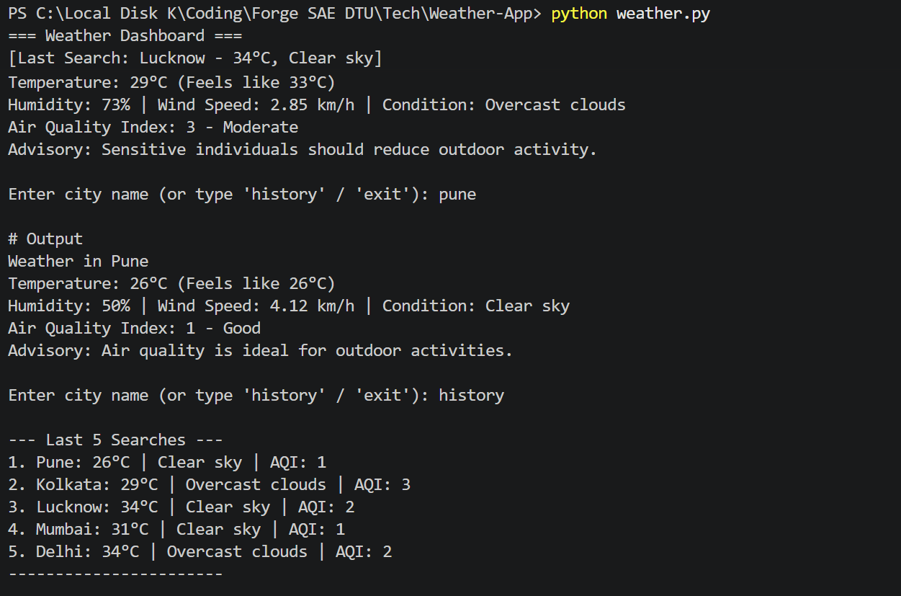

# 🌤️ CLI Weather & Air Quality Dashboard

A robust Command-Line Interface (CLI) application built in Python that fetches real-time meteorological and air pollution data from the OpenWeatherMap API.

## 🚀 Features
- Real-Time Weather: Dynamically fetches temperature, humidity, wind speed, and weather conditions.
- Air Quality Index (AQI): Maps geo-coordinates to the Air Pollution API, providing an AQI score and a health advisory.
- Search History Memory: Automatically saves the last 5 searched cities to a local history.json file.
- Robust Error Handling: Safely intercepts network drops and invalid city names without crashing.

## 🛠️ Setup Instructions for Reviewers

1. Clone the repository and navigate to the project directory:
git clone <your-repository-url>
cd Weather-App

2. Install the required dependencies:
pip install requests python-dotenv

3. Configure Environment Variables:
- Create a new file named .env in the root directory.
- Add your OpenWeather API key to the .env file like this:
OPENWEATHER_API_KEY=your_key_here

4. Run the application:
python weather.py

## 📊 Application Demo

Below is a demonstration of the dashboard handling multiple global cities, fetching both weather and air quality data, and displaying the persistent search history.

